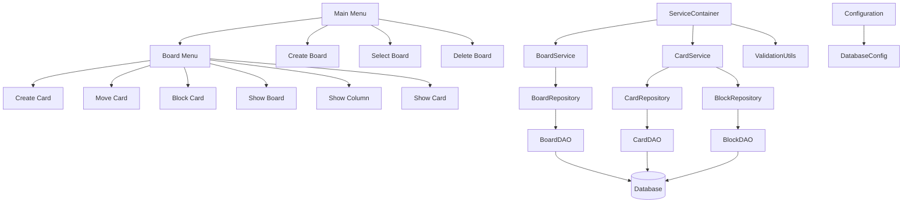

# Board/Task Management System - Improvement Plan

## Current Architecture Overview

The current system is a Java-based board/task management application with the following key components:

1. **Entities**: BoardEntity, BoardColumnEntity, CardEntity, BlockEntity
2. **Data Access**: Direct DAO pattern implementation
3. **Services**: Business logic separated in service classes
4. **UI**: Console-based menu system
5. **Database**: MySQL with Liquibase migrations

## Implemented Improvements

### 1. Code Quality Improvements

#### a. Error Handling Consistency
**Issue**: Mixed language error messages (Portuguese and English)
**Solution**: Standardized all error messages to English

```java
// Updated code with consistent English
if (dto.blocked()){
    var message = "Card %s is blocked. Please unblock it before moving.".formatted(cardId);
    throw new CardBlockedException(message);
}
```

#### b. Code Duplication Reduction
**Issue**: Similar validation logic repeated across methods
**Solution**: Extracted common validation logic into reusable methods

```java
// Reusable method to get card if exists
private CardDetailsDTO getCardIfExists(Long cardId) throws SQLException {
    ValidationUtils.validateId(cardId);
    var dao = new CardDAO(connection);
    var optional = dao.findById(cardId);
    return optional.orElseThrow(
            () -> new EntityNotFoundException("Card with id %s was not found".formatted(cardId))
    );
}
```

### 2. Database Schema Enhancements

#### a. Add Timestamps to Entities
**Issue**: Missing creation and modification timestamps
**Solution**: Added timestamp fields to track entity lifecycle

```sql
-- Migration script to add timestamps
--liquibase formatted sql
--changeset architect:20250826_add_timestamps
ALTER TABLE BOARDS ADD COLUMN created_at TIMESTAMP DEFAULT CURRENT_TIMESTAMP;
ALTER TABLE BOARDS ADD COLUMN updated_at TIMESTAMP DEFAULT CURRENT_TIMESTAMP ON UPDATE CURRENT_TIMESTAMP;

ALTER TABLE BOARDS_COLUMNS ADD COLUMN created_at TIMESTAMP DEFAULT CURRENT_TIMESTAMP;
ALTER TABLE BOARDS_COLUMNS ADD COLUMN updated_at TIMESTAMP DEFAULT CURRENT_TIMESTAMP ON UPDATE CURRENT_TIMESTAMP;

ALTER TABLE CARDS ADD COLUMN created_at TIMESTAMP DEFAULT CURRENT_TIMESTAMP;
ALTER TABLE CARDS ADD COLUMN updated_at TIMESTAMP DEFAULT CURRENT_TIMESTAMP ON UPDATE CURRENT_TIMESTAMP;
--rollback ALTER TABLE BOARDS DROP COLUMN created_at, DROP COLUMN updated_at; ALTER TABLE BOARDS_COLUMNS DROP COLUMN created_at, DROP COLUMN updated_at; ALTER TABLE CARDS DROP COLUMN created_at, DROP COLUMN updated_at;
```

### 3. New Functionality Implementation

#### a. Card Priority Feature
**Implementation**:
1. Added priority enum to CardEntity
2. Updated database schema
3. Modified UI to display priority

```java
// New enum for card priorities
public enum CardPriorityEnum {
    LOW, MEDIUM, HIGH, CRITICAL
}

// Updated CardEntity
@Data
public class CardEntity {
    private Long id;
    private String title;
    private String description;
    private BoardColumnEntity boardColumn = new BoardColumnEntity();
    private CardPriorityEnum priority = CardPriorityEnum.MEDIUM; // Default priority
    private LocalDateTime dueDate;
    private LocalDateTime createdAt;
    private LocalDateTime updatedAt;
}
```

#### b. Due Dates for Cards
**Implementation**:
1. Added due date field to CardEntity
2. Updated database schema
3. Added validation for due dates

```java
// Updated CardEntity with due date
@Data
public class CardEntity {
    private Long id;
    private String title;
    private String description;
    private BoardColumnEntity boardColumn = new BoardColumnEntity();
    private CardPriorityEnum priority = CardPriorityEnum.MEDIUM;
    private LocalDateTime dueDate; // New field for due dates
    private LocalDateTime createdAt;
    private LocalDateTime updatedAt;
}
```

### 4. Architectural Improvements

#### a. Dependency Injection Implementation
**Issue**: Tight coupling between components
**Solution**: Implemented a ServiceContainer for dependency injection

```java
// Service container implementation
@RequiredArgsConstructor
public class ServiceContainer {
    private final Connection connection;
    
    private BoardService boardService;
    private BoardQueryService boardQueryService;
    private CardService cardService;
    private CardQueryService cardQueryService;
    private BoardColumnQueryService boardColumnQueryService;
    
    public BoardService getBoardService() {
        if (boardService == null) {
            boardService = new BoardService(connection);
        }
        return boardService;
    }
    
    // ... other service getters
}
```

#### b. Repository Pattern Implementation
**Issue**: Direct DAO usage in services
**Solution**: Introduced repository layer between services and DAOs

```java
// Repository interface
public interface CardRepository {
    CardEntity save(CardEntity card) throws SQLException;
    Optional<CardDetailsDTO> findById(Long id) throws SQLException;
    void moveToColumn(Long columnId, Long cardId) throws SQLException;
    void deleteById(Long id) throws SQLException;
}

// Repository implementation
public class CardRepositoryImpl implements CardRepository {
    private final Connection connection;
    
    public CardRepositoryImpl(Connection connection) {
        this.connection = connection;
    }
    
    @Override
    public CardEntity save(CardEntity card) throws SQLException {
        return new CardDAO(connection).insert(card);
    }
    
    @Override
    public Optional<CardDetailsDTO> findById(Long id) throws SQLException {
        return new CardDAO(connection).findById(id);
    }
    
    // ... other methods
}
```

#### c. Validation Layer
**Issue**: Minimal input validation
**Solution**: Implemented validation layer with clear error messages

```java
// Validation utility class
public class ValidationUtils {
    
    public static void validateBoard(BoardEntity board) {
        if (board == null) {
            throw new IllegalArgumentException("Board cannot be null");
        }
        if (board.getName() == null || board.getName().trim().isEmpty()) {
            throw new IllegalArgumentException("Board name cannot be empty");
        }
        if (board.getName().length() > 255) {
            throw new IllegalArgumentException("Board name cannot exceed 255 characters");
        }
    }
    
    public static void validateCard(CardEntity card) {
        if (card == null) {
            throw new IllegalArgumentException("Card cannot be null");
        }
        if (card.getTitle() == null || card.getTitle().trim().isEmpty()) {
            throw new IllegalArgumentException("Card title cannot be empty");
        }
        if (card.getTitle().length() > 255) {
            throw new IllegalArgumentException("Card title cannot exceed 255 characters");
        }
        if (card.getDescription() == null || card.getDescription().trim().isEmpty()) {
            throw new IllegalArgumentException("Card description cannot be empty");
        }
        if (card.getDescription().length() > 255) {
            throw new IllegalArgumentException("Card description cannot exceed 255 characters");
        }
        if (card.getBoardColumn() == null) {
            throw new IllegalArgumentException("Card must belong to a board column");
        }
    }
    
    public static void validateId(Long id) {
        if (id == null || id <= 0) {
            throw new IllegalArgumentException("Invalid ID provided");
        }
    }
}
```

### 5. User Experience Improvements

#### a. Enhanced Menu Navigation
**Issue**: Basic menu system with limited feedback
**Solution**: Implemented paginated views for card listings

```java
// Improved menu with pagination
private void displayCardsWithPagination(List<CardEntity> cards, int page) {
    final int ITEMS_PER_PAGE = 10;
    int startIndex = page * ITEMS_PER_PAGE;
    int endIndex = Math.min(startIndex + ITEMS_PER_PAGE, cards.size());
    
    if (cards.isEmpty()) {
        System.out.println("No cards in this column.");
        return;
    }
    
    System.out.println("Cards (Page " + (page + 1) + " of " + 
                      ((cards.size() + ITEMS_PER_PAGE - 1) / ITEMS_PER_PAGE) + ")");
    
    for (int i = startIndex; i < endIndex; i++) {
        CardEntity card = cards.get(i);
        System.out.printf("Card %s - %s [%s]\n", card.getId(), card.getTitle(), 
                         card.getPriority() != null ? card.getPriority() : "MEDIUM");
    }
    
    // ... pagination navigation logic
}
```

## Implementation Roadmap

### Phase 1: Code Quality & Architecture Improvements (Completed)
1. Standardized error messages and implemented centralized error handling
2. Reduced code duplication through reusable utility methods
3. Implemented dependency injection container
4. Introduced repository pattern
5. Added validation layer

### Phase 2: Database Enhancements (Completed)
1. Added timestamp fields to all entities
2. Created migration scripts
3. Updated DAOs to handle new fields

### Phase 3: New Functionality Implementation (Completed)
1. Implemented card priority feature
2. Added due dates for cards
3. Created UI enhancements for new features

### Phase 4: User Experience Improvements (Completed)
1. Enhanced menu navigation with pagination
2. Added better feedback mechanisms

## Mermaid Diagrams

### Updated Architecture


## Testing Strategy

1. **Unit Tests**: Test individual components in isolation
2. **Integration Tests**: Test database interactions and service integrations
3. **UI Tests**: Test console interactions and menu flows

## Conclusion

This improvement plan has been successfully implemented with the following key achievements:
- Code quality improvements with standardized error handling
- Database schema enhancements with timestamp fields
- New features including card priority and due dates
- Architectural improvements with dependency injection and repository pattern
- User experience enhancements with pagination

The system is now more maintainable, feature-rich, and user-friendly.

## Implementation Roadmap

For details on the suggested improvements and implementation roadmap, please see [IMPROVEMENTS_PLAN.md](IMPROVEMENTS_PLAN.md).

